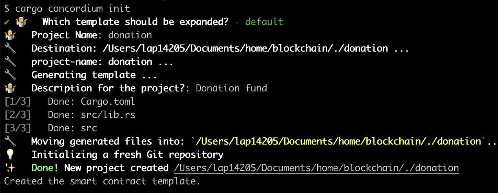
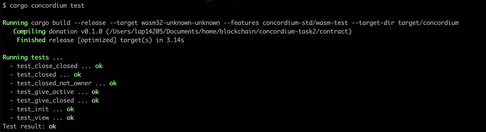
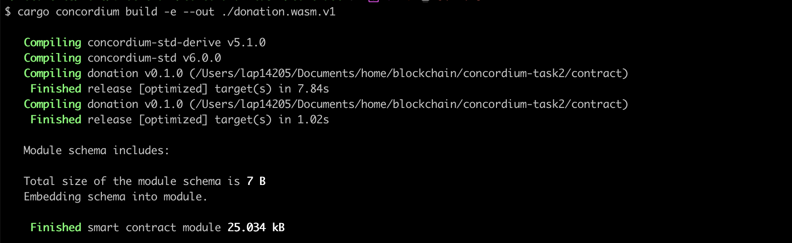
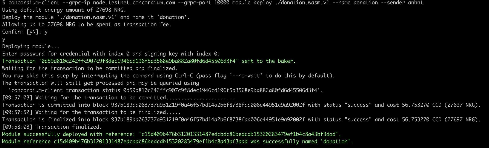
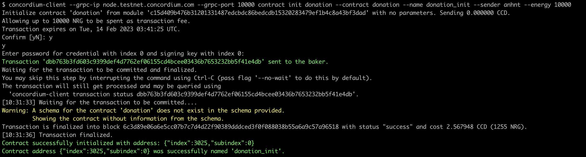
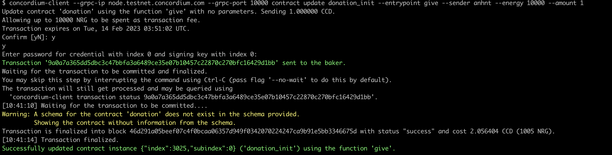
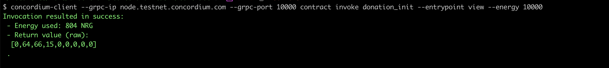

# Concordium Hackathon - TASK 2: Deploy Your First Smart Contract

## My wallet address
- Concordium Address (mainnet): 45GytP6c3bF7CKM6twuEfSHxnYkG3GoLkrLNm72t6o9YHQEmMu 
- USDT Address (Metamask): 0x1557EE78Ab23F7264366a055eCAce48390b5B0C7 

## Description
Project name: "donation" User can donate CCD to owner & owner can close the donation

## My process

### Generate project donation
```
cargo concordium init
```



### Test project
```
cargo concordium test
```


### Building a wasm module

```
cargo concordium build -e --out ./donation.wasm.v1
```



### Deploying a module
```
concordium-client --grpc-ip node.testnet.concordium.com --grpc-port 10000 module deploy ./donation.wasm.v1 --name donation --sender anhnt
```


Transaction: 
```
0d59d810c242ffc907c9f8dec1946cd196f5a3568e9ba882a80fd6d45506d3f4
```


### Initializing a module
```
concordium-client --grpc-ip node.testnet.concordium.com --grpc-port 10000 contract init donation --contract donation --name donation_init --sender anhnt --energy 10000
```


Transaction: 
```
dbb763b3fd603c9399def4d7762ef06155cd4bcee03436b7653232bb5f41e4db
```

### Update contract - call give
```
concordium-client --grpc-ip node.testnet.concordium.com --grpc-port 10000 contract update donation_init --entrypoint give --sender anhnt --energy 10000 --amount 1
```


Transaction: 
```
9a0a7a365dd5dbc3c47bbfa3a6489ce35e07b10457c22870c270bfc16429d1bb
```


### Invoke contract - call view
```
concordium-client --grpc-ip node.testnet.concordium.com --grpc-port 10000 contract invoke donation_init --entrypoint view --energy 10000
```

